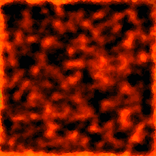

This demo shows automatic palette allocation. The grid on the top screen is a mirror to the target palette (here, palette 6 from main backgrounds' extended palette slot 1).

Possible operations:
- load/unload single color
- load/unload 4-bit palette slot (sequences of 15 colors + 1 transparent color) 
- load/unload entire asset palette

The palette manager tries to find free slots to load the colors. In case of failure, it is reported to the system (if that happens, then we should look for another palette to load the colors to, if possible).

The asset used is present in `res/magma_texture.8bpp.png`.

            

It is a 256x256 picture compiled as an 8-bit tileset.

The asset if accessed in code via the `AssetData` object `ROA_magma_texture8` (more on the conversion details later). For the time
being, the asset sources are pre-encoded into `roa_magma_texture8.h` and `roa_magma_texture8.s` files.

Example test run:
- https://youtu.be/Nq2mIhyPJTM